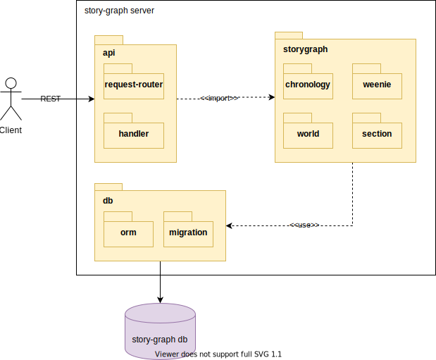

# :triangular_ruler: Artchitecture

## :space_invader: Abstractions

The main building blocks of storygraph are stories. Stories are made up of a set of weenies hosted in a world. As the story unfolds new events happen in which weenies and their relations change. Thus a story can be split up into an ordered set of events. Stories can then be organised into sections of events.

## :telescope: Module decomposition

Storygraph server acts as a REST service the main building blocks of which are:

- `api` which distributes http requests towards it's handler functions
- `storygraph` which is the core library.  It is composed of the components:
    - `chronology` responsible for state building by sequentially applying the delta from the events of a story
    - `weenie` responsible for weenie and edge modelling
    - `world` responsible for map modelling
    - `section` organising the story in lists of ordered events
- `db` which handles object-relational mapping and db migrations

## REST API

A reference to the API v1 can be found [here](API_V1.md).